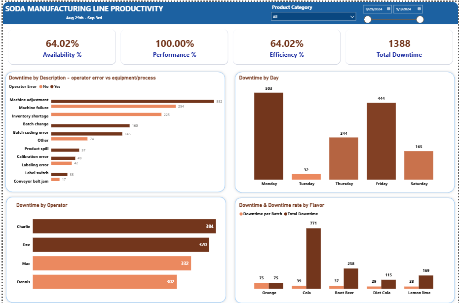
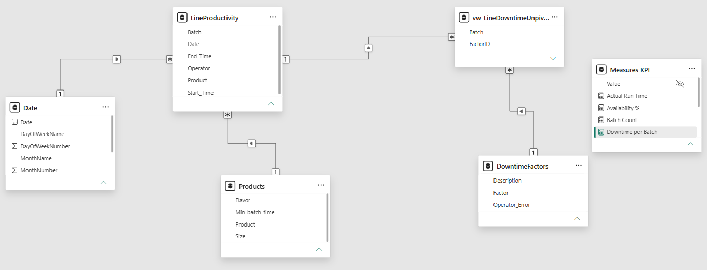

# Soda Manufacturing Line Productivity Analysis

##  Overview

This project involves cleaning and analysing production batch data from a beverage  bottling line. The dataset tracks batch runs across multiple product lines (Cola, Lemon 
Lime, Orange, Root Beer, Diet Cola), capturing operator shifts, downtime causes, and production timing to support process improvement decisions.

### Business Problem

The plant supervisor wants to know why the production line isn't hitting its productivity target, which downtime factors are costing the most time, and whether the issue is equipment, process, or operator-driven - so they know where to intervene first.

#### Dashboard

#### Tools & Tech Stack

SQL Server, T-SQL, Power BI, DAX and Power Query

#### Data Model

The model follows a star schema: LineProductivity (batch-level fact table) sits at the centre, related to Products and a calculated Date table as dimensions, with vw_LineDowntimeUnpivoted as a second fact table (one row per batch per downtime factor) relating to DowntimeFactors as a dimension.

Downtime was originally stored as a wide table (one column per factor, F1–F12). This was unpivoted in SQL into a long/tall fact table so Power BI could filter and aggregate downtime flexibly by factor, operator error, day, or product - a wide format would have made this analysis impractical.

#### Findings

1. The line isn't slow; it is stopping. i.e., performance sits at 100%, meaning when the line is running, it runs at full speed, but availability sits at 64.02%, same with efficiency. Which means the entire productivity gap is due to downtime. So, every point of efficiency recovered has to come from reducing stoppages.
2. Both equipment, process and operator behaviour need attention. Operator error downtime accounts for 52.4% of the total downtime, and equipment/process account for 47.6%. These numbers are close; hence, the intervention plan needs two-track running in parallel.
3. Three factors account for 58% of all downtime, which are
   * Machine adjustment - 332 mins (operator error)
   * Machine Failure - 254 mins (equipment process)
   * Inventory shortage - 225 mins (process chain)
   This accounts for 811 of 1388 mins of total downtime; hence, fixing them will move the needle more
4. Downtime clusters hard on Monday (505) and Friday (444), and this accounts for 68% of the week total downtime. Monday spikes often point to equipment sitting idle over the weekend and failing on restart or missing the start-up checklist, and Friday spikes often point to fatigued, rushed changeover or end-of-the-week short staffing. Hence, these 2 days need investigation
5. Operator downtime is evenly distributed. No single operator is disproportionately bad.
6. Cola shows the highest total downtime, but that reflects volume on a per batch cola shows Cola's downtime rate is the lowest of all five flavors.
7. 
